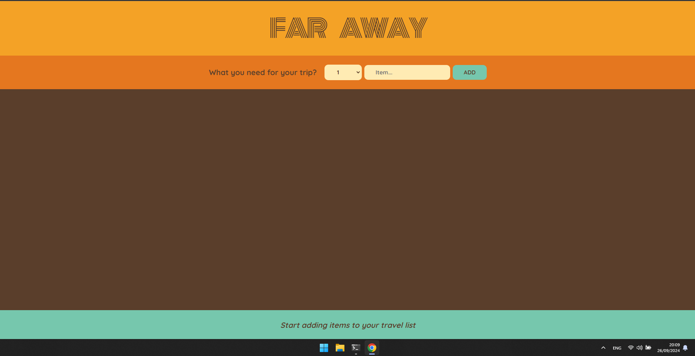
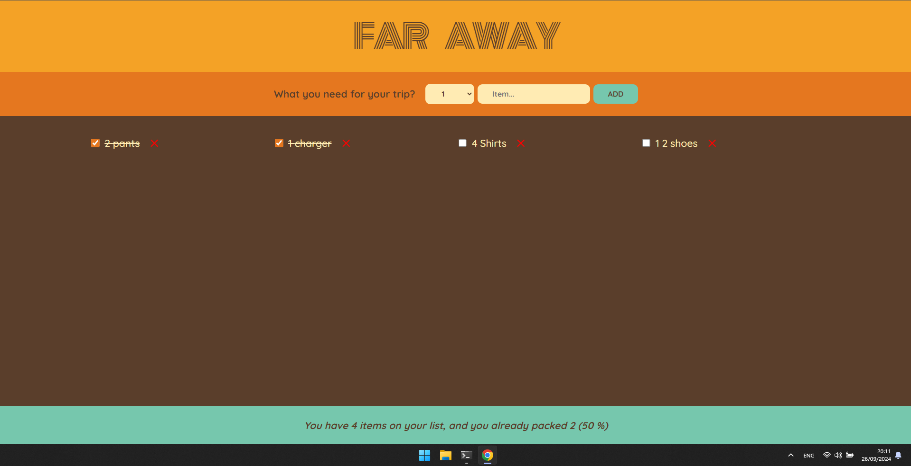

# 🧳 Travel List

Uma aplicação web para ajudar você a organizar itens essenciais antes de viajar. Com o **Travel List**, é possível adicionar, marcar e gerenciar facilmente tudo o que você precisa levar, garantindo uma viagem mais tranquila e sem imprevistos.


---

## 📸 Screenshots

<p float="left">
  
  
</p>

---

## 🚀 Funcionalidades

- Adicionar e remover itens da lista de viagem
- Marcar itens como concluídos
- Contagem automática de itens pendentes e concluídos
- Interface responsiva e intuitiva

---

## 🛠️ Tecnologias Utilizadas

- **React** – Biblioteca JavaScript para construção da interface
- **TypeScript** – Tipagem estática para maior segurança e legibilidade
- **CSS Modules** – Estilização modular e escopada por componente
- **Firebase** (se aplicável) – Autenticação e persistência de dados
- **Git & GitHub** – Versionamento de código

---

## 📦 Como rodar localmente

```bash
# Clone o repositório
git clone https://github.com/WalysonGomes/travel-list.git

# Acesse a pasta do projeto
cd travel-list

# Instale as dependências
npm install

# Inicie o servidor de desenvolvimento
npm run dev
